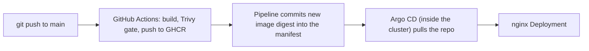

# Take-home assignment
> I want to sincerely thank you for taking time out for the interviews, and sincerely apologize that I won't be pursuing this opportunity. That said, the repo is here with the lab (somewhat) completed. I thoroughly enjoyed the assignment and learnt a lot! Feel free to reference it as needed. 

## CICD structure

**Main flow:** Anytime git push is done to the main branch, github actions is triggered to build and scan the image (CI), with a secondary job to update the deployment yaml for the applications with the new image digest. Since ArgoCD application is set to auto-sync, this ensures a totally automated CICD process after the developers push their code. 

## Repository layout

| Path | What it holds |
|---|---|
| `apps/hello-nginx`, `apps/second-page` | Dockerfile + static `index.html` for each app |
| `app-deployments/` | Kubernetes manifests that Argo CD deploys |
| `gitops/` | Argo CD `Application` definitions |
| `platform/` | Helm values for Traefik, Argo CD and Trivy Operator |
| `cluster/kind-config.yaml` | Local kind cluster (ports 80/443 mapped to the host) |
| `.github/workflows/` | Reusable `build-image.yaml` plus one small caller per app |

## 1. Outcomes that were looked for

1. **The page is served from an image you built.** — Yeap, done!
2. **Everything lives in a Git repository** — Done as well
3. **It reaches the cluster through automation, not your laptop.** — Heavy reliance on github actions but yes CICD is handled via automation
4. **Vulnerability scanning runs on a schedule inside the cluster** — Trivy-operator doing the heavy lifting, only a simple webhoot to ntfy for notifications and they really spam a lot since no control on what get's sent. 
5. **Nobody reaches the page without authenticating.** An anonymous visitor holding the URL should not see the hello world page.

## 3. Security expectations 

### Pipeline credentials
- **Registry:** the workflow logs in to GHCR with the built-in `GITHUB_TOKEN`. It is short-lived, created per run, and limited to that job (`packages: write`). No stored registry secret. 
- **Cluster:** got a bit lazy but the repo is public, so argoCD does not have to authenticate with it to check the repo state. Plan to add maybe ssh authentication in the future. 
- **Repo write access:** the manifest-update job has `contents: write` only, and only on that job. It pushes the digest change to `main`. **TODO:** mention branch protection as a production concern, since a workflow that can push to `main` is powerful.
- **Long-lived secrets that do exist:**
  - GitHub OAuth client secret and cookie secret: Kubernetes Secret in `hello-web` that was created manually. Readable by cluster admins. It can be rotated if a new secret is generated via Github UI.
  - `ghcr-pull` for `second-page`: second-page was used to test the pull-secret approach to pulling images from GCHR. It works, but it's just stored as a kubernetes secret. It only has read permissions when the token was generated via Github UI

### Acting on scan results
- **Build time:** the pipeline fails on fixable HIGH or CRITICAL findings, so a vulnerable image is never pushed.
- **Runtime:** Trivy Operator rescans every 24 hours and posts each report to ntfy.sh. That catches vulnerabilities published *after* an image was deployed. 
- **A pretty crappy webhook solution cause no time:** the webhook sends every report as raw JSON with no severity filter, so anything goes and it spams the ntfy topic. Will address in the future. 
- **Future improvements:** Add some kinda filter to parse the generated report and send a clean json via webhook.

### The finding I can't fix
1. For runtime scans if a critical vulnerability is picked up by trivy during the daily scan, I think the best course of action would be to scale down the deployment, until a clean base-image can be found and rebuilt, passing through the scans again.

### Image hygiene
- **Base image:** `nginxinc/nginx-unprivileged:stable-alpine`, pinned by digest. It is small (Alpine) and built to run without root.
- **Not root:** UID 101, port 8080, read-only root filesystem, with `/tmp` as an `emptyDir` because nginx needs a writable spot.
- **Deployed image is pinned too:** the pipeline writes the digest into the Deployment, so it kinda guarantees the latest image so long as no one messess around with it.

### Scan coverage
| Layer | Status | Catches | Misses |
|---|---|---|---|
| Build-time image scan (Trivy in CI) | Built | Known CVEs before an image is pushed | Anything disclosed later |
| Runtime scan (Trivy Operator) | Built | CVEs published after deploy; third-party images I did not build | Misconfiguration in code before it is applied |
| Infrastructure-code scan (Trivy config, Checkov, or similar on manifests and Terraform) | **Skipped**, discussion only | Risky settings in YAML/Terraform before apply | Vulnerabilities inside images |

### Least privilege
- **In the cluster (built):** namespaces enforce the `restricted` Pod Security level; all capabilities dropped; no privilege escalation; seccomp `RuntimeDefault`; service account token not mounted; resource limits set.
- **Future improvements:** Maybe implement network policies

## 5. Evidence it works

1. It works... you can view the alerts here https://ntfy.sh/trivy-alerts-91f5d6f881b3
2. Screenshots as attached https://we.tl/t-dtH7j1BPEyLNhLoN

## 6. Known limitations

- The ntfy topic name acts as a password. It is kept out of Git, but it sits in plain text in the Helm release and the operator's pod spec.
- The alert webhook is unfiltered and noisy.
- Self-signed certificate (Traefik default), plan to use actual cert in the future.
- No fixes done for found CVEs
- Currently repo is accessible by all, to limit in the future

