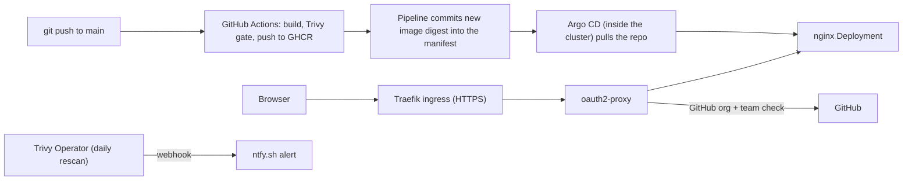

# Secured nginx on Kubernetes (DevSecOps take-home)

> **DRAFT SKELETON.** Everything marked **TODO** needs your own words, a fact only you know, or a check against what you actually ran. The pre-filled text comes from the repo files and our conversation. Rewrite it so you can defend every line at the showcase.

A static "hello world" page served by nginx on a local kind cluster. The point is everything around it: how the image is built, how it ships, who can reach it, and how vulnerabilities are found and reported.

## At a glance



**Key idea:** the pipeline never talks to the cluster. The cluster reaches *out* to Git, so no cluster credentials exist in CI.

## Repository layout

| Path | What it holds |
|---|---|
| `apps/hello-nginx`, `apps/second-page` | Dockerfile + static `index.html` for each app |
| `app-deployments/` | Kubernetes manifests that Argo CD deploys |
| `gitops/` | Argo CD `Application` definitions |
| `platform/` | Helm values for Traefik, Argo CD and Trivy Operator |
| `cluster/kind-config.yaml` | Local kind cluster (ports 80/443 mapped to the host) |
| `.github/workflows/` | Reusable `build-image.yaml` plus one small caller per app |

## 1. How to run it

**Prerequisites:** Docker Desktop, `kind`, `kubectl`, `helm`, `git`. (**TODO:** add versions you used; mention WSL2 if relevant.)

> **TODO:** replace the commands below with the exact ones you ran, and confirm the order works from a clean cluster.

```bash
# 1. Cluster
kind create cluster --config cluster/kind-config.yaml

# 2. Ingress (Traefik)
helm repo add traefik https://traefik.github.io/charts
helm install traefik traefik/traefik -n traefik --create-namespace \
  -f platform/traefik-values.yaml

# 3. Argo CD
helm repo add argo https://argoproj.github.io/argo-helm
helm install argocd argo/argo-cd -n argocd --create-namespace \
  -f platform/argocd-values.yaml

# 4. Trivy Operator (scheduled in-cluster scanning)
helm repo add aqua https://aquasecurity.github.io/helm-charts/
helm install trivy-operator aqua/trivy-operator -n trivy-system --create-namespace \
  --version <PINNED_VERSION> -f platform/trivy-operator-values.yaml \
  --set operator.webhookBroadcastURL=https://ntfy.sh/<YOUR_SECRET_TOPIC>
```

**Secrets (created by hand, never committed).** **TODO:** put your real commands here.

```bash
# OAuth app credentials + cookie secret for oauth2-proxy
kubectl create secret generic oauth2-proxy -n hello-web \
  --from-literal=client-id=<GITHUB_OAUTH_CLIENT_ID> \
  --from-literal=client-secret=<GITHUB_OAUTH_CLIENT_SECRET> \
  --from-literal=cookie-secret=<RANDOM_32_BYTE_VALUE>

# Pull secret for the second-page image (TODO: say what kind of credential this is)
kubectl create secret docker-registry ghcr-pull -n second-page-app \
  --docker-server=ghcr.io --docker-username=<USER> --docker-password=<TOKEN>
```

The `hello-web` and `second-page-app` namespaces come from the manifests, so create the secrets after Argo CD's first sync (or apply the `namespace.yaml` files first). Until the secrets exist, the pods sit in `CreateContainerConfigError`, which is expected.

**Register the apps with Argo CD:** **TODO:** state how (`kubectl apply -f gitops/` or the UI), and make sure the `path:` in `gitops/*.yaml` matches `app-deployments/...`. It currently says `k8s`.

**Open it:** `https://hello.localhost` (accept the self-signed certificate warning), then log in with a GitHub account that belongs to the allowed team.

## 2. What I built vs. what I only designed

| Built and running | Designed only (discussion at the showcase) |
|---|---|
| Hardened nginx image, digest-pinned, non-root | AKS provisioning (cluster RBAC, registry access, network exposure, workload identity) |
| GitHub Actions pipeline: build, Trivy gate, push to GHCR, update manifest | Entra ID login instead of GitHub |
| Argo CD pull-based deployment | Scanning infrastructure code before apply |
| oauth2-proxy with GitHub org/team access control over HTTPS | Automatic blocking or rollback on scan findings |
| Trivy Operator with daily rescans | Key Vault based secret delivery |
| Webhook alert to ntfy.sh | **TODO:** anything else, e.g. NetworkPolicies, SBOM, signing, Kyverno |

## 3. Decisions and what I weighed them against

**TODO:** one or two sentences each in your own words. Starting points:

| Decision | Alternatives considered | Why (draft) |
|---|---|---|
| Local kind cluster | k3s, minikube, real AKS | Free and matches the brief's expected answer. |
| Pull-based deploy with Argo CD | Self-hosted runner that runs `kubectl`; real AKS reached directly by CI | A hosted runner cannot reach a laptop cluster. Pull means the cluster reaches out and CI holds no cluster credentials. |
| Traefik ingress | ingress-nginx | ingress-nginx is retired. **TODO:** confirm wording. |
| oauth2-proxy + GitHub | Basic auth annotation; Entra ID | Real identity and easy to demo. Entra ID is what I would run on Azure. |
| GitHub **team** instead of an email list | Email allowlist file | Access is managed in GitHub, so joiners and leavers need no manifest change or redeploy. |
| Trivy in CI, Trivy Operator in the cluster | Other scanners | One tool and one severity policy at both layers. |
| ntfy.sh webhook | Slack, Teams, email | Zero-setup for a demo. See limitations. |

## 4. Security expectations (section 3 of the brief)

**Areas I chose to go deep on:** **TODO:** pick 3 to 4, for example *pipeline credentials, image hygiene, scan coverage, acting on scan results*. I cover the rest more briefly.

### Pipeline credentials
- **Registry:** the workflow logs in to GHCR with the built-in `GITHUB_TOKEN`. It is short-lived, created per run, and limited to that job (`packages: write`). No stored registry secret.
- **Cluster:** the pipeline never holds cluster credentials. Argo CD runs inside the cluster and pulls from Git.
- **Repo write access:** the manifest-update job has `contents: write` only, and only on that job. It pushes the digest change to `main`. **TODO:** mention branch protection as a production concern, since a workflow that can push to `main` is powerful.
- **Long-lived secrets that do exist:**
  - GitHub OAuth client secret and cookie secret: Kubernetes Secret in `hello-web`, created by hand, not in Git. Readable by cluster admins. Rotate by generating a new client secret in GitHub, updating the Secret, and restarting the pod.
  - `ghcr-pull` for `second-page`: **TODO:** what credential is it, what scope, who can read it, how would you rotate it?
- **Alternatives:** long-lived registry PAT in a CI variable (rejected), OIDC federation to Azure for the AKS version (production plan).

### Acting on scan results
- **Build time:** the pipeline fails on fixable HIGH or CRITICAL findings, so a vulnerable image is never pushed.
- **Runtime:** Trivy Operator rescans every 24 hours and posts each report to ntfy.sh. That catches vulnerabilities published *after* an image was deployed.
- **Honest gaps:** the webhook sends every report as raw JSON with no severity filter, and nothing blocks or rolls back a running workload.
- **Next step:** a small CronJob that reads the reports and only alerts on Critical findings, plus a ticket in the team's tracker. To block, an admission policy (Kyverno) or a Git revert that Argo CD applies.

### The finding I can't fix
**TODO:** write this in your own words. Draft outline:
1. Check whether it is reachable or exploitable in this image (a static nginx page with no shell, running non-root).
2. Look for a newer base image, or switch base (distroless or a minimal alternative).
3. Apply compensating controls (read-only filesystem, no capabilities, NetworkPolicy) and record them.
4. Accept the risk in writing, with an owner and an expiry date, and track it in an ignore or VEX file so it is not silently forgotten.
5. Keep rescanning, so the alert fires when a fix ships.

### Image hygiene
- **Base image:** `nginxinc/nginx-unprivileged:stable-alpine`, pinned by digest. It is small (Alpine) and built to run without root.
- **Not root:** UID 101, port 8080, read-only root filesystem, with `/tmp` as an `emptyDir` because nginx needs a writable spot.
- **Deployed image is pinned too:** the pipeline writes the digest into the Deployment.
- **Trade-off:** digest pinning means no automatic patches. **TODO:** mention a scheduled rebuild or Renovate/Dependabot as the fix. Currently, rebuilds only happen on pushes to the app folders.

### Scan coverage
| Layer | Status | Catches | Misses |
|---|---|---|---|
| Build-time image scan (Trivy in CI) | Built | Known CVEs before an image is pushed | Anything disclosed later |
| Runtime scan (Trivy Operator) | Built | CVEs published after deploy; third-party images I did not build | Misconfiguration in code before it is applied |
| Infrastructure-code scan (Trivy config, Checkov, or similar on manifests and Terraform) | **Skipped**, discussion only | Risky settings in YAML/Terraform before apply | Vulnerabilities inside images |

**TODO:** add anything else you covered (secret scanning, SBOM).

### Least privilege
- **In the cluster (built):** namespaces enforce the `restricted` Pod Security level; all capabilities dropped; no privilege escalation; seccomp `RuntimeDefault`; service account token not mounted; resource limits set.
- **Gaps to name:** no NetworkPolicies yet, and Argo CD and Trivy Operator hold broad cluster permissions by design. **TODO:** check and state what they actually have.
- **In Azure (designed):** kubelet or workload identity with `AcrPull` scoped to one registry, no ACR admin user, Entra-integrated AKS RBAC by group, workload identity instead of stored credentials.

## 5. Evidence it works

**TODO:** add screenshots or a recording link.
- [ ] Pipeline run showing the Trivy gate passing (and ideally one failing)
- [ ] Argo CD showing the app Synced/Healthy
- [ ] Anonymous request being redirected to GitHub login
- [ ] Non-member getting rejected, and a team member getting in
- [ ] `kubectl get vulnerabilityreports -A -o wide` output
- [ ] The ntfy notification arriving

## 6. Known limitations

- The ntfy topic name acts as a password. It is kept out of Git, but it sits in plain text in the Helm release and the operator's pod spec.
- The alert webhook is unfiltered and noisy.
- Existing login sessions stay valid after the access rule changes, until the cookie expires.
- `second-page` is served over plain HTTP with no authentication. **TODO:** fix it or explain why.
- Self-signed certificate (Traefik default), which is fine for a demo.
- Findings in third-party components (for example Argo CD, kindnet) are reported but not fixed, as the brief says.

## 7. What I'd do differently in production

- **AKS** provisioned with Terraform: private cluster, Entra-integrated RBAC, workload identity, ACR with private endpoint.
- **Login with Entra ID** groups instead of a GitHub team.
- **Secrets from Azure Key Vault** (CSI driver or External Secrets), not hand-made Secrets.
- **Authenticated alert channel** (Teams, PagerDuty, ticketing) and filtered alerts.
- **Admission control** (Kyverno or Azure Policy) and signed images (cosign) so unscanned or unsigned images cannot run.
- **NetworkPolicies**, branch protection, and scheduled base-image rebuilds.
- **Real certificates and DNS**.

## 8. Time spent and what's next

**TODO:** roughly how many hours, what blocked you, and what you would do next with more time.